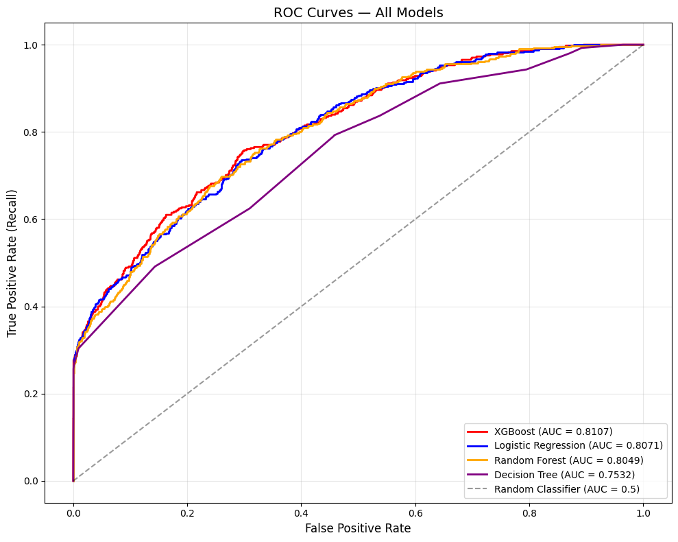
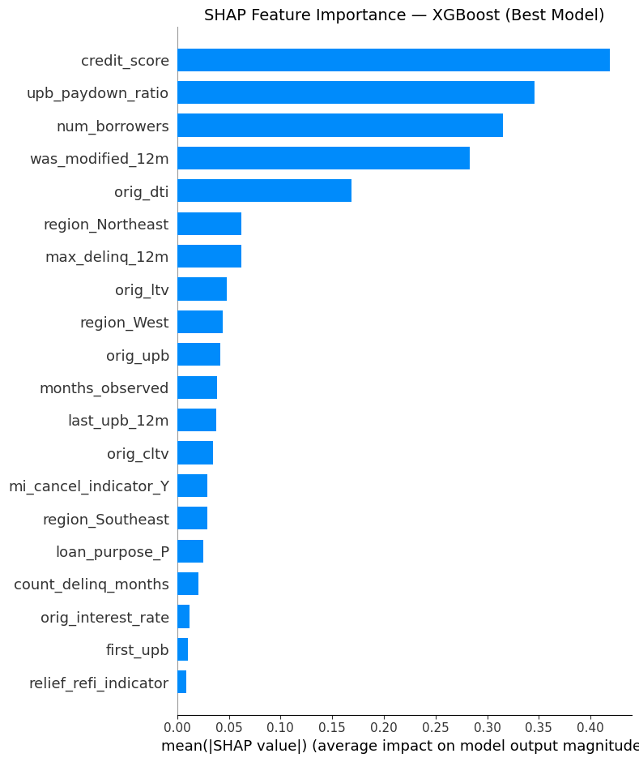

# Mortgage Default Risk Prediction Using Machine Learning

Predicting loan defaults on Freddie Mac's Single-Family Loan-Level Dataset using XGBoost, achieving **0.82 ROC-AUC** with SHAP-based interpretability.

## Problem Statement

When a borrower defaults, Freddie Mac absorbs credit losses typically ranging from $50,000–$80,000 per loan. This project builds a classification model to identify high-risk loans at origination using borrower characteristics, loan terms, and early payment behavior — enabling proactive risk management before losses materialize.

## Dataset

- **Source:** [Freddie Mac Single-Family Loan-Level Dataset](https://www.freddiemac.com/research/datasets/sf-loanlevel-dataset)
- **Vintage:** 2015 sample (50,000 loans)
- **Files:** Origination file (32 columns) + Monthly performance file (32 columns, ~3M records)
- **Format:** Pipe-delimited (`|`) text files with sentinel codes for missing values

> **Note:** The data is not included in this repo due to licensing. You can download it for free from Freddie Mac's [Clarity Data Intelligence portal](https://claritydownload.fmapps.freddiemac.com/CRT/#/sflld) after registration.

## Approach

### 1. Data Engineering
- Parsed raw pipe-delimited files and mapped column names using Freddie Mac's official data dictionary
- Replaced 7 types of sentinel "Not Available" codes (9999, 999, 99, etc.) with proper null values
- Linked origination and monthly performance files on Loan Sequence Number

### 2. Target Variable Construction
- **Default definition:** Loan reaches 90+ days delinquent (delinquency status ≥ 3) after month 12
- **Leakage prevention:** Strict temporal split — only months 0–11 used for features, months 12+ used to define the target
- **Default rate:** ~4% (imbalanced classification problem)

### 3. Feature Engineering (17 features)
- **Risk flags:** High LTV (>80%), high DTI (>43%), low FICO (<680), high interest rate (>4.5%)
- **Interaction terms:** Low FICO × high LTV, low FICO × high DTI
- **Behavioral signals:** Early delinquency flags, UPB paydown ratio, modification indicator, delinquent month count
- **Geographic:** Mapped 50 U.S. states to 6 Census regions
- **Derived:** CLTV-LTV gap (secondary financing indicator), FICO tier buckets, loan term buckets

### 4. Modeling
| Model | ROC-AUC |
|-------|---------|
| XGBoost | **~0.82** |
| Random Forest | ~0.80 |
| Logistic Regression | ~0.78 |
| Decision Tree | ~0.75 |

- All models tuned via **5-fold stratified GridSearchCV**
- Class imbalance handled with `balanced` class weights and `scale_pos_weight`
- Robustness validated by ablating the strongest predictor and confirming minimal AUC drop

### 5. Interpretability & Threshold Optimization
- **SHAP analysis** identified top default drivers: credit score, early payment behavior, DTI, number of borrowers
- **Threshold optimization** using Youden's J statistic significantly improved default recall over the standard 0.50 cutoff

## Key Results




## Tech Stack

- **Languages:** Python
- **ML/Modeling:** Scikit-learn, XGBoost, SHAP
- **Data Processing:** Pandas, NumPy
- **Visualization:** Matplotlib, Seaborn
- **Evaluation:** ROC-AUC, Precision-Recall curves, Confusion Matrix, F1-score

## How to Run

```bash
# Clone the repo
git clone https://github.com/pranav9-ds/mortgage-default-prediction.git
cd mortgage-default-prediction

# Install dependencies
pip install -r requirements.txt

# Download the 2015 sample data from Freddie Mac and place in data/ folder
# Then open the notebook
jupyter notebook notebooks/mortgage_default_analysis.ipynb
```

## Project Structure

```
mortgage-default-prediction/
├── README.md
├── notebooks/
│   └── mortgage_default_analysis.ipynb
├── data/
│   └── README.md              # Instructions to download data
├── images/                    # Saved plots for README
├── requirements.txt
└── .gitignore
```

## Author

- Pranav Waghmare
